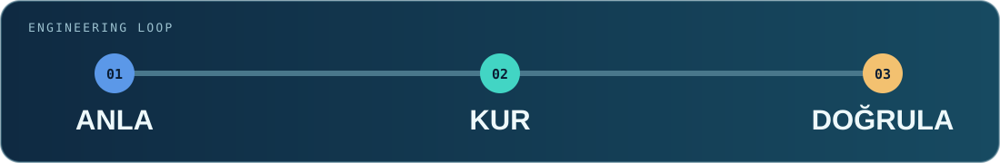

  

  <strong>C# / .NET geliştiricisi</strong> 
  Servisler, masaüstü araçları ve iyi düşünülmüş kullanıcı akışları.

  <a href="https://github.com/erenilgun10?tab=repositories">Tüm açık projeler</a> ·
  <a href="https://github.com/erenilgun10/Wand-Enhancer">WandEnhancer</a> ·
  <a href="https://github.com/erenilgun10/NewMicroservice">Catalog API</a>

## Merhaba, ben Eren 👋

Bir özelliğin yalnızca **çalışmasına** değil, nasıl anlaşıldığına, nasıl doğrulandığına ve gerektiğinde nasıl geri alınacağına da önem veriyorum. C# ve .NET ile servis tarafındaki veri akışından Windows üzerindeki son kullanıcı ekranına kadar uzanan işler üzerinde çalışıyorum.

Özellikle katmanlar arasındaki sınırları netleştirmeyi, karmaşık işlemleri sade arayüzlere çevirmeyi ve işin sonunda gerçekten neyin test edildiğini açıkça söylemeyi seviyorum.

  

## Neler yapıyorum?

| Servis ve API | Windows araçları | Arayüz ve deneyim |
| :--- | :--- | :--- |
| C#/.NET ile açık sözleşmeli servisler, veri akışları ve test edilebilir katmanlar. | Tekrarlanan işi azaltan masaüstü uygulamaları ve pratik otomasyonlar. | Bir işlemin başlangıcından hata durumuna ve geri almaya kadar anlaşılır ekranlar. |

### Araç çantam

| Alan | Teknolojiler ve pratikler |
| :--- | :--- |
| Uygulama | `C#` · `.NET` · `ASP.NET Core` · `WinForms` |
| Veri | `Entity Framework` · `MongoDB` · `SQL` |
| Arayüz | `HTML` · `CSS` · kullanıcı akışı tasarımı |
| Geliştirme | `Git` · `Docker` · `GitHub Actions` · test otomasyonu |

## Seçili açık çalışmalar

<table>
  <tr>
    <td width="50%" valign="top">
      <h3><a href="https://github.com/erenilgun10/Wand-Enhancer">✦ WandEnhancer ↗</a></h3>
      
Wand istemcisinin yerel ayarlarını genişleten, birlikte çalışabilirlik ve kullanım deneyimi odaklı açık kaynak araç.

      UX · birlikte çalışabilirlik · istemci aracı
    </td>
    <td width="50%" valign="top">
      <h3><a href="https://github.com/erenilgun10/NewMicroservice">◈ NewMicroservice ↗</a></h3>
      
.NET 10 Catalog API çalışması; MongoDB Entity Framework Core, OpenAPI/Scalar ve ayrı test projesi içeriyor.

      C# · ASP.NET Core · MongoDB · testler
    </td>
  </tr>
  <tr>
    <td width="50%" valign="top">
      <h3><a href="https://github.com/erenilgun10/Inventory">▣ Inventory ↗</a></h3>
      
Arayüz, iş mantığı ve veri katmanlarını ayıran .NET 10 Windows Forms envanter uygulaması.

      C# · WinForms · katmanlı yapı
    </td>
    <td width="50%" valign="top">
      <h3><a href="https://github.com/erenilgun10/insanKaynaklari">◇ insanKaynaklari ↗</a></h3>
      
Entity Framework ile Database First yaklaşımını kullanan İK uygulaması.

      .NET · Entity Framework · Database First
    </td>
  </tr>
</table>

<a href="https://github.com/erenilgun10?tab=repositories"><strong>Diğer açık depolara göz at →</strong></a>

## Kodun izi 🐍

Bu animasyon, GitHub katkı kutularından üretilir ve düzenli olarak yenilenir. GitHub'ın kendi grafiğini değiştirmez; onun hareketli bir yorumunu gösterir.

<picture>
  <source media="(prefers-reduced-motion: reduce)" srcset="./assets/snake-still.svg" />
  <source media="(prefers-color-scheme: dark)" srcset="https://raw.githubusercontent.com/erenilgun10/erenilgun10/output/github-contribution-grid-snake-dark.svg" />
  <source media="(prefers-color-scheme: light)" srcset="https://raw.githubusercontent.com/erenilgun10/erenilgun10/output/github-contribution-grid-snake.svg" />
  
</picture>

Build thoughtfully. Verify honestly. Keep improving.

