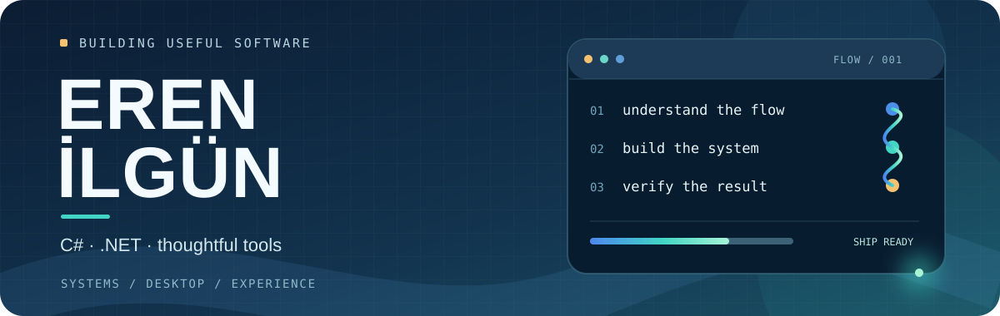

  

### Merhaba 👋

Ben **Eren İlgün**. C# ve .NET ekosisteminde, karmaşık işleri daha anlaşılır ve kullanışlı hâle getiren yazılımlar üretmeyi seviyorum. İşin hem arka plandaki akışına hem de ekranda nasıl hissettirdiğine önem veriyorum.

### Odak alanlarım

`C#` &nbsp; ` .NET ` &nbsp; `Windows uygulamaları` &nbsp; `Servisler` &nbsp; `Arayüz deneyimi`

> İyi bir araç, güçlü olduğu kadar anlaşılır ve geri alınabilir de olmalı.

<a href="https://github.com/erenilgun10?tab=repositories">Açık projelere göz at →</a>

### Kodun izi

<picture>
  <source media="(prefers-reduced-motion: reduce)" srcset="./assets/snake-still.svg" />
  <source media="(prefers-color-scheme: dark)" srcset="https://raw.githubusercontent.com/erenilgun10/erenilgun10/output/github-contribution-grid-snake-dark.svg" />
  <source media="(prefers-color-scheme: light)" srcset="https://raw.githubusercontent.com/erenilgun10/erenilgun10/output/github-contribution-grid-snake.svg" />
  
</picture>

Katkı grafiği her gün güncellenir. 🐍

